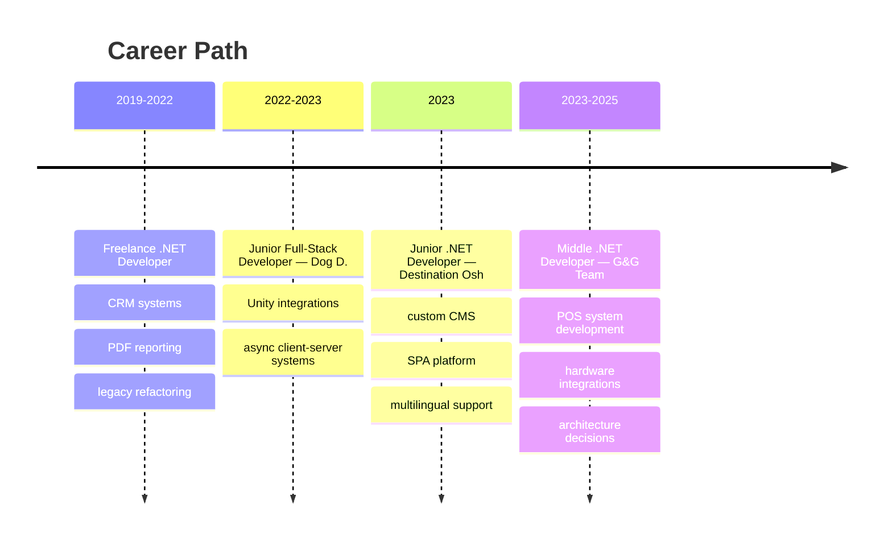

# Hi 👋 I'm Bayastan Asanov

.NET Developer from Bishkek 🇰🇬

## 👨‍💻 About Me

* Programming with **C# since 9th grade**
* Commercial experience building **POS systems, CMS, SPA and client-server applications**
* Interested in **software architecture and scalable systems**
* Experience integrating **payment terminals, receipt printers and POS hardware**
* Focus on **maintainable and long-living architecture**
* Mentored junior developers and helped with onboarding

## 🚀 Tech Stack

| Category | Technologies |
|--------|--------|
| Backend | C#, .NET, ASP.NET |
| Desktop | WPF, Avalonia, Xamarin |
| Frontend | React, TypeScript, TailwindCSS, Svelte |
| Game | Unity, Godot |
| Architecture | Clean Architecture, CQRS, Unit of Work, Event-Driven |
| Infrastructure | Docker, Nginx, RabbitMQ, GitHub Actions, CI/CD |
| Libraries | Entity Framework, MediatR, ReactiveUI, Source Generators |

## 💼 Experience

## 🌍 Languages

* 🇷🇺 Russian — Native
* 🇬🇧 English — B1
